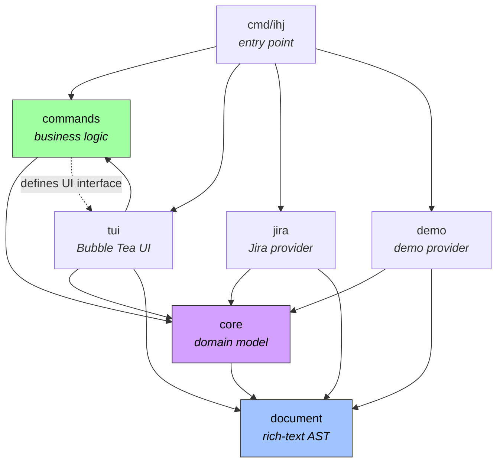

# Architecture

## Overview

ihj is a provider-agnostic work-tracking CLI and TUI. The architecture follows
two principles: **producers create structs, consumers define interfaces**, and
**each provider is a self-contained vertical slice**. The `core` package
contains the pure domain model with no I/O or framework imports. The `commands`
package implements business logic against abstract interfaces. Concrete
providers (Jira, Demo) and the TUI implement those interfaces.

## Project Layout

```
ihj/
├── cmd/ihj/                  # Entry point — Cobra CLI, wires providers + TUI
│   ├── main.go               # Config loading, provider creation, session setup
│   └── cli.go                # Command tree (tui, create, edit, export, apply, …)
├── internal/
│   ├── core/                 # Pure domain model — no I/O, no framework imports
│   │   ├── provider.go       # Provider + ContentRenderer interfaces, Capabilities, FieldDef
│   │   ├── work.go           # WorkItem, Changes, EncodeManifest/DecodeManifest, schema helpers
│   │   ├── workspace.go      # Workspace, TypeConfig, provider constants
│   │   ├── tree.go           # Hierarchy utilities (BuildRegistry, LinkChildren)
│   │   └── errors.go         # CancelledError sentinel
│   ├── commands/             # Business logic — one handler per file
│   │   ├── session.go        # Runtime, WorkspaceSession, factory type
│   │   ├── ui.go             # UI + UILauncher interfaces, LaunchUIData
│   │   ├── create.go         # Create command
│   │   ├── edit.go           # Edit command
│   │   ├── comment.go        # Comment command
│   │   ├── assign.go         # Assign command
│   │   ├── transition.go     # Transition command
│   │   ├── open.go           # Open-in-browser command
│   │   ├── branch.go         # Branch name command
│   │   ├── extract.go        # Extract context for LLM
│   │   ├── export.go         # Export manifest
│   │   ├── apply.go          # Apply manifest changes
│   │   ├── cache.go          # Cache management
│   │   └── editor.go         # Editor integration (temp files, cursor placement)
│   ├── document/             # Rich-text AST — format-agnostic interchange
│   │   ├── node.go           # Node type, marks, constructors
│   │   ├── parse_markdown.go # Markdown → AST
│   │   ├── render_markdown.go# AST → Markdown
│   │   ├── render_ansi.go    # AST → terminal output (via glamour)
│   │   └── themes.go         # Glamour style configs
│   ├── tui/                  # Bubble Tea terminal UI
│   │   ├── app.go            # AppModel — main Update/View loop
│   │   ├── list.go           # Issue list with fuzzy filter
│   │   ├── detail.go         # Issue detail pane
│   │   ├── popup.go          # Modal selection popup
│   │   ├── theme.go          # Lipgloss styles, colour palette
│   │   ├── keys.go           # Key bindings
│   │   ├── ui.go             # Implements commands.UI interface
│   │   ├── headless.go       # Standalone mini-TUI for CLI commands
│   │   ├── upsert.go         # Edit/create state machine
│   │   ├── extract.go        # Extract-context state machine
│   │   └── messages.go       # Tea.Msg types for async communication
│   ├── jira/                 # Jira provider (vertical slice)
│   │   ├── provider.go       # Implements core.Provider
│   │   ├── client.go         # HTTP client, API interface
│   │   ├── config.go         # Jira-specific workspace config
│   │   ├── bootstrap.go      # Interactive workspace setup
│   │   ├── parse_adf.go      # Jira ADF → document AST
│   │   ├── render_adf.go     # Document AST → Jira ADF
│   │   ├── types.go          # Jira REST API response types
│   │   ├── cache.go          # Per-workspace response cache
│   │   ├── query.go          # JQL query builder
│   │   ├── workflow.go       # Status transition helpers
│   │   ├── registry.go       # Jira issue → WorkItem conversion
│   │   └── payloads.go       # API request payload builders
│   └── demo/                 # In-memory demo provider
│       ├── provider.go       # Implements core.Provider
│       └── data.go           # Synthetic WorkItems
```

## Package Dependencies



Solid arrows are direct imports. The dashed arrow from `commands` to `tui`
represents an interface boundary: `commands` defines the `UI` and `UILauncher`
interfaces, `tui` implements them. They never import each other directly —
`cmd/ihj/main.go` wires the concrete implementations at startup.

## Packages

### core

The pure domain model. Defines `WorkItem` (the universal unit of work),
`Provider` (the interface every backend must implement), `Workspace`
(configuration for a scope of work items), `Capabilities` (feature flags a
provider advertises), `Changes` (a mutation to apply), `ContentRenderer`
(format-agnostic content conversion), and `FieldDef` (provider-declared field
metadata). Field metadata (`FieldType`, `FieldVisibility`, `FieldDef`) drives
serialization, schema generation, and diff/apply behaviour — providers declare
which fields they support, how they should be displayed, and whether they are
editable. `EncodeManifest` and `DecodeManifest` are the single serialization
paradigm for the export/apply manifest, replacing per-type Marshal/Unmarshal
methods. Also provides tree utilities for building parent-child hierarchies,
JSON Schema generation (`ManifestSchema`), and frontmatter/schema helpers for
the editor integration. Has no I/O, no HTTP, no framework imports.

### commands

Business logic layer. `Runtime` holds app-wide shared state: the `UI`,
`UILauncher`, workspace map, theme, and cache directory. `WorkspaceSession`
pairs a `Runtime` with a specific `Workspace` and its `Provider` — this is the
per-workspace context threaded through commands. `WorkspaceSessionFactory` is a
`func(slug string) (*WorkspaceSession, error)` that creates sessions on demand,
enabling lazy provider creation and future workspace switching. Each command
(create, edit, comment, assign, transition, export, apply, extract, branch,
open, cache) lives in its own file and operates through the `Provider`, `UI`,
and `UILauncher` interfaces. `UI` abstracts small interactions (select, confirm,
edit text, notify). `UILauncher` abstracts the full-screen UI launch. Commands
never touch stdin/stdout directly.

### tui

The Bubble Tea terminal UI. `AppModel` is the top-level model managing a
list pane, detail pane, and popup overlay. Sub-models handle their own
Update/View cycles. `BubbleTeaUI` implements `commands.UI` by sending
messages to the running Bubble Tea program and blocking on responses. The
`headless` module provides standalone mini-TUIs for CLI commands that need
interactive input outside the main TUI (e.g., `ihj assign FOO-1`).

### jira

The Jira provider, structured as a vertical slice. `Provider` implements
`core.Provider` by translating between Jira's REST API types and universal
`WorkItem` structs. `FieldDefinitions` declares Jira-specific field metadata
(priority, assignee, labels, components, reporter, created, updated) that
drives the manifest serialization and apply diff logic. The `API` interface
wraps the HTTP client, making it mockable for tests — this includes
`SearchUsers` for resolving email addresses to Jira account IDs during apply.
ADF (Atlassian Document Format) is converted to/from the document AST via
`parse_adf.go` and `render_adf.go`. Supports caching, JQL query building,
status transitions, and interactive bootstrap for new workspaces.

### demo

An in-memory provider backed by synthetic `WorkItem` data. Implements
`core.Provider` with simulated latency. Uses Markdown as its native content
format (converting to/from the document AST). Used by `ihj jira demo` for
testing the TUI without credentials.

### document

A format-agnostic rich-text AST. The `Node` type represents documents,
paragraphs, headings, lists, code blocks, tables, and inline marks (bold,
italic, code, links, etc.). Parsers and renderers convert between the AST
and concrete formats: Markdown (parse + render), ANSI terminal output (via
glamour), and provider-specific formats (Jira ADF, handled in the jira
package). This decouples content handling from any single backend.

## Design Patterns

### Producers create structs, consumers define interfaces

`core.Provider` is defined in `core` and implemented by `jira.Provider` and
`demo.Provider`. `commands.UI` is defined in `commands` and implemented by
`tui.BubbleTeaUI`. `commands.UILauncher` is defined in `commands` and
implemented by `tuiLauncher` in `cmd/ihj/main.go`. Consumers own their
interfaces; producers just satisfy them. This keeps the dependency arrows
pointing inward.

### Vertical slices for providers

Each provider is self-contained: its own types, API client, format converters,
config parsing, and caching. Adding a new backend means creating a new package
under `internal/` — no changes to core, commands, or tui are needed beyond
wiring in `cmd/ihj/main.go`.

### Document AST as interchange

Rich text is never passed around as raw HTML, Markdown, or ADF. Providers
convert their native format to/from the document AST on read/write. The TUI
renders the AST to ANSI via glamour. The editor works in Markdown, which is
parsed back to AST on save. This means format conversion logic lives in
exactly one place per format.

### Runtime + WorkspaceSession + Factory

`Runtime` holds app-wide shared state (UI, Launcher, workspace map, theme,
cache directory, output writers). `WorkspaceSession` pairs a `Runtime` with a
specific `Workspace` and its `Provider` — this is the per-workspace dependency
container threaded through commands. `WorkspaceSessionFactory` is a closure
(`func(slug string) (*WorkspaceSession, error)`) defined in `main.go` that
creates sessions on demand, resolving the workspace, instantiating the provider,
and connecting to the backend. This separation enables lazy provider creation,
on-demand workspace switching, and clean testing (swap the factory or provider).

### UILauncher interface

`Runtime` has a `Launcher UILauncher` field instead of importing the `tui`
package directly. The `UILauncher` interface defines a single method,
`LaunchUI(*LaunchUIData) error`, following the same consumer-defines-interface
pattern used for `UI`. This breaks what would otherwise be a circular
dependency: `tui` imports `commands` (for the `UI` interface and session types),
so `commands` cannot import `tui`. The concrete implementation (`tuiLauncher`)
lives in `cmd/ihj/main.go` and wires up a Bubble Tea program, but the
abstraction allows for alternative full-screen implementations.

### Field metadata and manifest serialization

Providers declare their field capabilities via `FieldDefinitions() []FieldDef`.
Each `FieldDef` specifies a key, display label, type (`string`, `enum`,
`string_array`, `bool`), valid enum values, visibility (`default`, `extended`,
`readonly`), and whether to hoist the field to the top level of the manifest
item (vs. nesting in a `fields:` bag).

This metadata drives three subsystems:

1. **Serialization** — `EncodeManifest` uses field defs to decide which fields
   appear at the item level, which go in the `fields:` bag, and which are
   omitted (based on `full` flag and visibility). `DecodeManifest` reverses
   the process, routing top-level keys back into the `Fields` map. This
   replaces the old `MarshalYAML`/`MarshalJSON` methods on `WorkItem`.

2. **Schema generation** — `ManifestSchema` produces a JSON Schema from the
   workspace config and field defs. Each top-level `FieldDef` becomes a
   property on the item schema with the correct type and enum constraints.
   The schema is written alongside exports for editor autocompletion.

3. **Diff and apply** — `computeDiff` iterates all non-read-only field defs
   to detect changes between the manifest and the remote state. `applyUpdate`
   maps those diffs into `Changes.Fields` entries for the provider. Read-only
   fields (e.g., created/updated dates) are never diffed or applied.

Visibility controls export inclusion: `FieldDefault` fields always appear,
`FieldExtended` fields (e.g., reporter) appear only with `--full`, and
`FieldReadOnly` fields (e.g., created, updated) appear only with `--full`
and are never applied back. Both `FieldDefault` and `FieldExtended` fields
are diffed and applied when present in a manifest.

## Adding a New Provider

1. Create `internal/yourprovider/` with a `Provider` struct.
2. Implement `core.Provider` (Search, Get, Create, Update, Comment, Assign,
   CurrentUser, Capabilities, FieldDefinitions) and `core.ContentRenderer`
   (ParseContent, RenderContent).
3. Implement `FieldDefinitions() []core.FieldDef` to declare provider-specific
   fields (e.g., priority, assignee, labels). These drive manifest
   serialization, JSON Schema generation, and the apply diff logic. Use
   `TopLevel: true` for fields that should appear at the item level in exports.
4. Add a `config.go` to parse provider-specific workspace fields.
5. Add a provider constant to `internal/core/workspace.go`
   (e.g., `ProviderGitHub = "github"`).
6. Wire the provider in `cmd/ihj/main.go`'s `newProviderForWorkspace` switch
   and `initSession` hydration loop.
