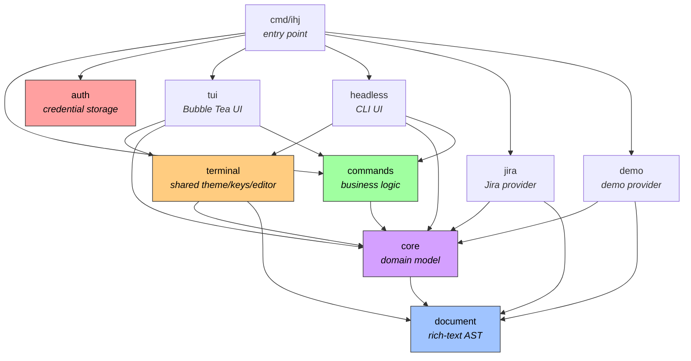

# Architecture

## Overview

ihj is a provider-agnostic work-tracking CLI and TUI. The architecture follows
two principles: **producers create structs, consumers define interfaces**, and
**each provider is a self-contained vertical slice**. The `core` package
contains the pure domain model with no I/O or framework imports. The `commands`
package implements business logic against abstract interfaces. Concrete
providers (Jira, Demo) and the TUI implement those interfaces.

## Project Layout

```
ihj/
├── cmd/ihj/                  # Entry point — Cobra CLI, wires providers + TUI
│   ├── main.go               # Provider creation, session setup, TUI launch
│   ├── cli.go                # Command tree (tui, create, edit, export, apply, auth, …)
│   └── config.go             # Config loading, validation, uiCaps
├── internal/
│   ├── auth/                 # Credential storage abstraction
│   │   ├── store.go          # CredentialStore interface, ChainStore
│   │   ├── keychain.go       # OS keychain backend (via go-keyring)
│   │   ├── env.go            # Environment variable backend (read-only)
│   │   └── file.go           # JSON file backend (fallback)
│   ├── core/                 # Pure domain model — no I/O, no framework imports
│   │   ├── provider.go       # Provider + ContentRenderer interfaces, Capabilities, FieldDef
│   │   ├── work.go           # WorkItem, Changes, EncodeManifest/DecodeManifest, schema helpers
│   │   ├── workspace.go      # Workspace, TypeConfig, provider constants
│   │   ├── frontmatter.go    # Frontmatter/schema helpers for editor integration
│   │   ├── tree.go           # Hierarchy utilities (BuildRegistry, LinkChildren)
│   │   └── errors.go         # CancelledError sentinel
│   ├── commands/             # Business logic — one handler per file
│   │   ├── session.go        # Runtime, WorkspaceSession, factory type
│   │   ├── ui.go             # UI + UILauncher interfaces, LaunchUIData
│   │   ├── create.go         # Create command
│   │   ├── edit.go           # Edit command
│   │   ├── comment.go        # Comment command
│   │   ├── assign.go         # Assign command
│   │   ├── transition.go     # Transition command
│   │   ├── open.go           # Open-in-browser command
│   │   ├── branch.go         # Branch name command
│   │   ├── extract.go        # Extract context for LLM
│   │   ├── export.go         # Export manifest
│   │   ├── apply.go          # Apply manifest changes
│   │   ├── cache.go          # Cache management
│   │   └── retry.go          # Retry/re-edit logic for validation failures
│   ├── document/             # Rich-text AST — format-agnostic interchange
│   │   ├── node.go           # Node type, marks, constructors
│   │   ├── parse_markdown.go # Markdown → AST
│   │   ├── render_markdown.go# AST → Markdown
│   │   ├── render_ansi.go    # AST → terminal output (via glamour)
│   │   └── themes.go         # Glamour style configs
│   ├── terminal/             # Shared terminal utilities
│   │   ├── theme.go          # Theme, Styles, colour palette, Lipgloss styles
│   │   ├── keys.go           # KeyMap bindings (default + vim)
│   │   └── editor.go         # Editor launching, clipboard, shell helpers
│   ├── headless/             # Headless CLI UI (commands.UI for non-TUI usage)
│   │   ├── ui.go             # HeadlessUI — spawns mini-TUIs + Huh for input
│   │   └── models.go         # Standalone Bubble Tea models (select, confirm, prompt, diff)
│   ├── tui/                  # Full-screen Bubble Tea terminal UI
│   │   ├── app.go            # AppModel — main Update/View loop, key handling
│   │   ├── vim.go            # Vim modal key handling (normal/search/command modes)
│   │   ├── action.go         # Action enum and resolution
│   │   ├── list.go           # Issue list with fuzzy filter
│   │   ├── detail.go         # Issue detail pane with child navigation
│   │   ├── popup.go          # Modal selection/input popup
│   │   ├── ui.go             # BubbleTeaUI — commands.UI impl + UIEvent system
│   │   └── messages.go       # Tea.Msg types for async communication
│   ├── jira/                 # Jira provider (vertical slice)
│   │   ├── provider.go       # Implements core.Provider
│   │   ├── client.go         # HTTP client, API interface
│   │   ├── config.go         # Jira-specific workspace config
│   │   ├── bootstrap.go      # Interactive workspace setup + server alias derivation
│   │   ├── parse_adf.go      # Jira ADF → document AST
│   │   ├── render_adf.go     # Document AST → Jira ADF
│   │   ├── types.go          # Jira REST API response types
│   │   ├── cache.go          # Per-workspace response cache
│   │   ├── query.go          # JQL query builder
│   │   ├── workflow.go       # Status transition helpers
│   │   ├── registry.go       # Jira issue → WorkItem conversion
│   │   └── payloads.go       # API request payload builders
│   ├── demo/                 # In-memory demo provider
│   │   ├── provider.go       # Implements core.Provider
│   │   └── data.go           # Synthetic WorkItems
│   └── testutil/             # Shared test fixtures and mocks
│       ├── fixtures.go       # TestWorkspace, TestItems, TestHarness, TestChildChain
│       ├── mock_provider.go  # MockProvider (core.Provider)
│       ├── mock_ui.go        # MockUI (commands.UI)
│       ├── mock_credentials.go # MockCredentialStore (auth.CredentialStore)
│       └── ansi.go           # StripANSI helper for golden test comparison
```

## Package Dependencies



Solid arrows are direct imports. Dashed arrows represent interface boundaries:
`commands` defines the `UI` and `UILauncher` interfaces, which `tui` and
`headless`, implement. `cmd/ihj/main.go` wires the concrete
implementations at startup — `headless.HeadlessUI` for CLI commands,
`tui.BubbleTeaUI` for the full-screen TUI (swapped in during `LaunchUI`).

## Field Conventions

**Omitted fields are no-ops.** When a field is absent from frontmatter,
a manifest node, or a `Changes` struct, the system does nothing for that
field — it is not cleared, reset, or defaulted. This is essential for
diff-based updates: only fields the user explicitly sets are sent to the
provider.

**Explicit removal requires a sentinel value.** When a field needs to support
"clear this value", a dedicated sentinel (typically `"none"` for enum fields,
`""` for string fields) is used. For example, the `sprint` field on scrum
boards is an enum of `active | future | none`: omitting `sprint` means "don't
change the sprint", while `sprint: none` explicitly moves the issue to the
backlog (removing it from any sprint).

## Packages

### core

The pure domain model. Defines `WorkItem` (the universal unit of work),
`Provider` (the interface every backend must implement), `Workspace`
(configuration for a scope of work items), `Capabilities` (structural feature flags: `HasTransitions`, `HasHierarchy`,
`HasTypes` — field-level capabilities are derived from `FieldDefinitions()`), `Changes` (a mutation to apply), `ContentRenderer`
(format-agnostic content conversion), and `FieldDef` (provider-declared field
metadata). Field metadata (`FieldType`, `FieldRole`, `FieldDef`) drives
serialization, schema generation, and diff/apply behaviour — providers declare
which fields they support, their semantic role, and whether they are
editable. `EncodeManifest` and `DecodeManifest` are the single serialization
paradigm for the export/apply manifest, replacing per-type Marshal/Unmarshal
methods. Also provides tree utilities for building parent-child hierarchies,
JSON Schema generation (`ManifestSchema`), and frontmatter/schema helpers for
the editor integration. Has no I/O, no HTTP, no framework imports.

### commands

Business logic layer. `Runtime` holds app-wide shared state: the `UI`,
`UILauncher`, workspace map, theme, and cache directory. `WorkspaceSession`
pairs a `Runtime` with a specific `Workspace` and its `Provider` — this is the
per-workspace context threaded through commands. `WorkspaceSessionFactory` is a
`func(slug string) (*WorkspaceSession, error)` that creates sessions on demand,
enabling lazy provider creation and future workspace switching. Each command
(create, edit, comment, assign, transition, export, apply, extract, branch,
open, cache) lives in its own file and operates through the `Provider`, `UI`,
and `UILauncher` interfaces. `UI` abstracts small interactions (select, confirm,
edit text, notify). `UILauncher` abstracts the full-screen UI launch. Commands
never touch stdin/stdout directly.

### terminal

Shared terminal utilities used by both `tui` and `headless`. Contains the
`Theme` and `Styles` (Lipgloss colour palette and pre-computed styles),
`KeyMap` (key bindings), and editor/clipboard helpers (`PrepareEditor`,
`CopyToClipboard`, `SplitShellCommand`). This is a leaf package that imports
`core` and `document` but nothing from `commands`, `tui`, or `headless`.

### headless

Implements `commands.UI` for non-interactive CLI usage. `HeadlessUI` spawns
short-lived Bubble Tea programs for interactive prompts (select, confirm,
prompt, review diff), uses Huh for multi-line text input (`InputText`), and
launches `$EDITOR` for document editing (`EditDocument`). Used for headless
commands like `ihj assign FOO-1`, `ihj comment FOO-1`, `ihj edit FOO-1`.

### tui

The full-screen Bubble Tea terminal UI. `AppModel` is the top-level model
managing a list pane, detail pane, and popup overlay. Sub-models handle their
own Update/View cycles. `BubbleTeaUI` implements `commands.UI` but only uses
`Notify` (via `program.Send`) and `Status` — all interactive prompts are
handled by the TUI's own `PopupModel`. The TUI imports theme, styles, and key
bindings from the `terminal` package via type aliases in `terminal.go`.

The TUI supports two layout modes: **split view** (list + detail side by side)
and **focus mode** (detail pane fills the screen, entered via `Enter`). In
split view, `Tab` toggles keyboard focus between panes — when the detail pane
is focused, navigation keys scroll the detail content instead of moving the
list cursor. Child issues are navigable via hint keys (`0`–`9`, then letters),
with `Backspace` popping the child history stack. The detail pane height in
split view is configurable via `layout.detail_height` (default 55%). The help
bar can be hidden via `layout.show_help_bar: false`; in vim mode a minimal
mode indicator (NORMAL/://) is always shown regardless of this setting.

`BubbleTeaUI.Emit(kind, kv...)` sends structured `UIEvent` values to a
buffered channel for test observability. The channel is nil in production
(no-op). Journey tests assert on these events rather than parsing terminal
output. Event kinds are typed `EventKind` constants (compile-time safe):
`EventReady`, `EventViewList`, `EventViewDetail`, `EventViewFullscreen`,
`EventNavigated`, `EventBack`, `EventNotify`, `EventPopupSelect`,
`EventPopupInput`, `EventPopupConfirm`.

### jira

The Jira provider, structured as a vertical slice. `Provider` implements
`core.Provider` by translating between Jira's REST API types and universal
`WorkItem` structs. `FieldDefinitions` declares Jira-specific field metadata
(priority, assignee, labels, components, sprint, reporter, created, updated)
that drives the manifest serialization and apply diff logic. Sprint is
conditionally included for scrum boards only (`board_type: scrum` in config)
as an enum field: `active` assigns to the current sprint, `future` assigns to
the next upcoming sprint, and `none` moves the issue to the backlog (removing
it from any sprint). Sprint assignment is a post-create/post-update operation
via the Agile REST API — it is not part of the standard issue create/update
payload. Field metadata is discovered dynamically from Jira's createmeta API
(per issue type), cached to disk with a 24-hour TTL, and merged with the
hardcoded global field definitions. This populates enum values (e.g., actual
priority levels), required custom fields, and `FieldID` mappings for payload
construction. If the createmeta API is unavailable (permissions, Jira Server),
the provider falls back to hardcoded defaults silently. The `API` interface
wraps the HTTP client, making it mockable for tests — this includes
`SearchUsers` for resolving email addresses to Jira account IDs during apply.
ADF (Atlassian Document Format) is converted to/from the document AST via
`parse_adf.go` and `render_adf.go`. Supports caching, JQL query building,
status transitions, and interactive bootstrap for new workspaces.

### demo

An in-memory provider backed by synthetic `WorkItem` data. Implements
`core.Provider` with simulated latency. Uses Markdown as its native content
format (converting to/from the document AST). Used by `ihj jira demo` for
testing the TUI without credentials.

### auth

Credential storage abstraction. Defines the `CredentialStore` interface with
three backends: `KeychainStore` (OS keychain via go-keyring), `EnvStore`
(read-only lookup from `IHJ_TOKEN_<ALIAS>` environment variables), and
`FileStore` (JSON file with 0600 permissions). `ChainStore` composes backends
in priority order — the composition root in `cmd/ihj/main.go` builds the chain
as keychain → env → file, probing keychain availability at startup. The `auth`
package has no dependencies on `core`, `commands`, or any provider package — it
is a pure infrastructure leaf that can be reused for future OAuth token storage.

### document

A format-agnostic rich-text AST. The `Node` type represents documents,
paragraphs, headings, lists, code blocks, tables, and inline marks (bold,
italic, code, links, etc.). Parsers and renderers convert between the AST
and concrete formats: Markdown (parse + render), ANSI terminal output (via
glamour), and provider-specific formats (Jira ADF, handled in the jira
package). This decouples content handling from any single backend.

**AST normalization.** The Markdown parser (goldmark) normalizes list items
on parse: empty items always receive an empty `Paragraph` child, matching
the structural invariant that ADF requires (every `listItem` must contain at
least one block node). This gives all downstream renderers a consistent shape
regardless of input format.

**Round-trip fidelity.** The Markdown → AST → Markdown path is designed to be
stable: rendering the AST and re-parsing the output should produce the same
AST. An edge-case test suite (`ast_edge_cases_test.go`) verifies this across
empty structures, nested lists, inline marks, tables, and code blocks. One
known limitation exists: list items whose first child is a nested list rather
than a paragraph (e.g., `- -` parsed as a nested empty bullet) are unstable
on round-trip because goldmark's indentation rules for nesting conflict with
the prefix-then-content rendering model. This pattern is uncommon in real
issue descriptions.

## Design Patterns

### Producers create structs, consumers define interfaces

`core.Provider` is defined in `core` and implemented by `jira.Provider` and
`demo.Provider`. `commands.UI` is defined in `commands` and implemented by
two UI backends: `headless.HeadlessUI` (CLI) and `tui.BubbleTeaUI` (full-screen
TUI). `commands.UILauncher` is
defined in `commands` and implemented by `tuiLauncher` in `cmd/ihj/main.go`.
Consumers own their interfaces; producers just satisfy them. This keeps the
dependency arrows pointing inward.

### Vertical slices for providers

Each provider is self-contained: its own types, API client, format converters,
config parsing, and caching. Adding a new backend means creating a new package
under `internal/` — no changes to core, commands, etc. are needed beyond
wiring in `cmd/ihj/main.go`.

### Document AST as interchange

Rich text is never passed around as raw HTML, Markdown, or ADF. Providers
convert their native format to/from the document AST on read/write. The TUI
renders the AST to ANSI via glamour. The editor works in Markdown, which is
parsed back to AST on save. This means format conversion logic lives in
exactly one place per format.

### Runtime + WorkspaceSession + Factory

`Runtime` holds app-wide shared state (UI, Launcher, workspace map, theme,
cache directory, output writers). `WorkspaceSession` pairs a `Runtime` with a
specific `Workspace` and its `Provider` — this is the per-workspace dependency
container threaded through commands. `WorkspaceSessionFactory` is a closure
(`func(slug string) (*WorkspaceSession, error)`) defined in `main.go` that
creates sessions on demand, resolving the workspace, looking up the server token
via the `auth.CredentialStore`, instantiating the provider, and connecting to
the backend. Multiple workspaces sharing the same `ServerAlias` share the same
token. This separation enables lazy provider creation, on-demand workspace
switching, and clean testing (swap the factory or provider).

### UILauncher interface

`Runtime` has a `Launcher UILauncher` field instead of importing the `tui`
package directly. The `UILauncher` interface defines a single method,
`LaunchUI(*LaunchUIData) error`, following the same consumer-defines-interface
pattern used for `UI`. This breaks what would otherwise be a circular
dependency: `tui` imports `commands` (for the `UI` interface and session types),
so `commands` cannot import `tui`. The concrete implementation (`tuiLauncher`)
lives in `cmd/ihj/main.go` and wires up a Bubble Tea program, but the
abstraction allows for alternative full-screen implementations.

### Field metadata and manifest serialization

Providers declare their field capabilities via `FieldDefinitions() FieldDefs`.
Each `FieldDef` specifies a key, display label, type (`string`, `enum`,
`string_array`, `bool`, `email`, `assignee`), valid enum values, a semantic
`Role` (`ownership`, `urgency`, `temporal`, `categorisation`, `iteration`,
`custom`),
and boolean attributes that control behaviour:

- **Primary** — top-level field in manifests, exported by default, shown
  prominently in the TUI detail pane and list columns.
- **Derived** — computed by the provider (e.g., reporter); included in exports
  for context but never diffed or applied back.
- **Immutable** — cannot be changed after creation (e.g., created date);
  excluded from schemas and diffs.
- **Optional** — may not be present in all workspaces (e.g., components).
- **WriteOnly** — the manifest/frontmatter value is an *action* that
  differs from the displayed value (e.g., `sprint: active` assigns the
  current sprint, but the TUI displays the sprint name). The provider
  reads the current value normally; write-only refers to the import
  direction only.
- **FieldID** — backend-native identifier (e.g., `customfield_10016`).
  Used by the provider for payload construction and API field requests.
- **Required** — field is required for issue creation (discovered from
  the provider's metadata API).
- **Pinned** — user explicitly opted in via per-type config; always shown
  in the TUI even when empty.

A field is **informational** (`Informational() = WriteOnly || Immutable`) when
its exported value is read-only context, not actionable on import. Full exports
(`--full`) prefix informational field keys with `_` (e.g., `_sprint`, `_created`)
to signal they are ignored on import.

Derived methods replace direct attribute checks: `ExportByDefault()`
(Primary && !Derived && !Informational), `Diffable()` (!Derived && !Immutable),
`TopLevelField()` (Primary), `IncludeInSchema()` (!Derived && !Immutable).
The `FieldDefs` named slice type provides lookup helpers: `ByRole(role)`,
`Primary()`, `WithKey(key)`.

This metadata drives three subsystems:

1. **Serialization** — `EncodeManifest` uses field defs to decide which fields
   appear at the item level (Primary), which go in the `fields:` bag, and
   which are omitted (based on `full` flag and attributes). `DecodeManifest`
   reverses the process, routing top-level keys back into the `Fields` map.

2. **Schema generation** — `ManifestSchema` produces a JSON Schema from the
   workspace config and field defs. Each Primary `FieldDef` becomes a
   property on the item schema with the correct type and enum constraints.
   Derived and Immutable fields are excluded. The schema is written alongside
   exports for editor autocompletion.

3. **Diff and apply** — `computeDiff` iterates all Diffable field defs
   to detect changes between the manifest and the remote state. `applyUpdate`
   maps those diffs into `Changes.Fields` entries for the provider.

4. **CLI validation** — `ValidateFieldOverrides` checks `--set` overrides
   against FieldDefs before any API call: rejects unknown fields and read-only
   fields, validates enum values, and normalises casing to the canonical form
   (e.g., `"high"` → `"High"`).

5. **TUI rendering** — the detail pane and list columns use Role-based lookups
   (`ByRole(RoleUrgency).Primary()`) instead of hardcoded field names. Style
   is derived from Role + Primary, not per-field constants. The detail pane
   renders metadata in role order: ownership → temporal → iteration →
   categorisation, with a separate FIELDS section for custom/type-specific
   fields. This makes the rendering provider-agnostic.

## Adding a New Provider

1. Create `internal/yourprovider/` with a `Provider` struct.
2. Implement `core.Provider` (Search, Get, Create, Update, Comment, Assign,
   CurrentUser, Capabilities, FieldDefinitions) and `core.ContentRenderer`
   (ParseContent, RenderContent).
3. Implement `FieldDefinitions() core.FieldDefs` to declare provider-specific
   fields with semantic Roles and attributes. These drive manifest serialization,
   JSON Schema generation, TUI rendering, and the apply diff logic. Set
   `Primary: true` for fields that appear at the item level in exports and
   prominently in the TUI. Set `Role` to the appropriate semantic grouping
   (e.g., `RoleOwnership` for assignee, `RoleUrgency` for priority).
4. Add a `config.go` to parse provider-specific workspace fields.
5. Add a provider constant to `internal/core/workspace.go`
   (e.g., `ProviderGitHub = "github"`).
6. Wire the provider in `cmd/ihj/main.go`'s `newProviderForWorkspace` switch
   and `initSession` hydration loop. Token lookup uses the `auth.CredentialStore`
   passed to `newProviderForWorkspace` — resolve by `ws.ServerAlias`.
