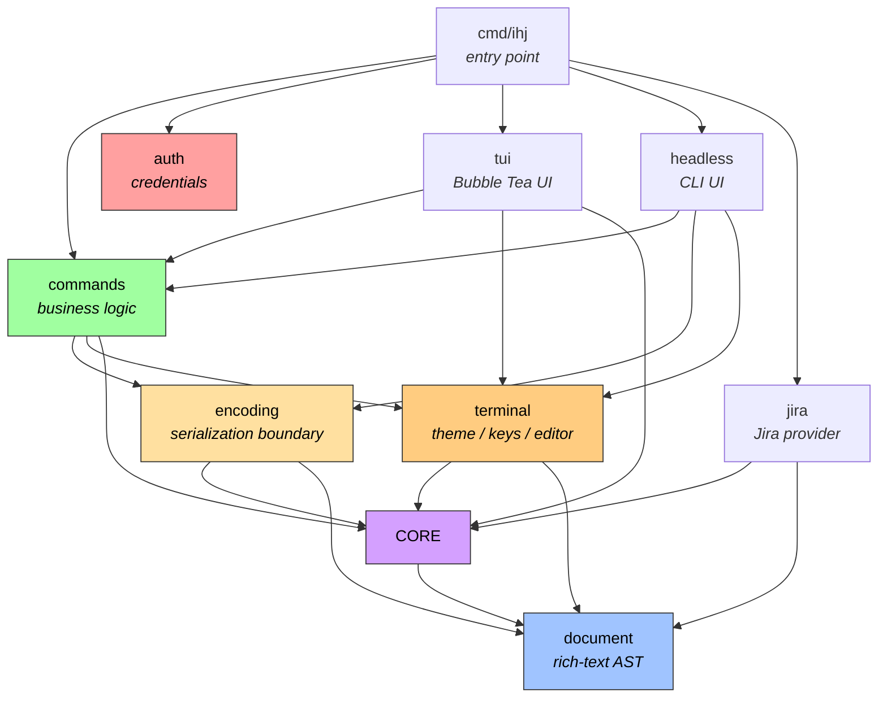

# Architecture

## Overview

ihj is a provider-agnostic work-tracking CLI and TUI. The architecture follows
two principles: **producers create structs, consumers define interfaces**, and
**each provider is a self-contained vertical slice**. The `core` package
contains the pure domain model with no I/O or framework imports. The `commands`
package implements business logic against abstract interfaces. Concrete
providers (Jira) and UI backends (TUI, headless) implement those interfaces.

## Package Dependencies

```mermaid
graph TD
    CMD["cmd/ihj<br/><i>entry point</i>"] --> COMMANDS
    CMD --> AUTH["auth<br/><i>credentials</i>"]
    CMD --> TUI["tui<br/><i>Bubble Tea UI</i>"]
    CMD --> HEADLESS["headless<br/><i>CLI UI</i>"]
    CMD --> JIRA["jira<br/><i>Jira provider</i>"]

    COMMANDS["commands<br/><i>business logic</i>"] --> ENCODING
    COMMANDS --> TERMINAL["terminal<br/><i>theme / keys / editor</i>"]
    COMMANDS --> CORE

    ENCODING["encoding<br/><i>serialization boundary</i>"] --> CORE
    ENCODING --> DOCUMENT["document<br/><i>rich-text AST</i>"]

    TUI --> COMMANDS
    TUI --> TERMINAL
    TUI --> CORE

    HEADLESS --> COMMANDS
    HEADLESS --> ENCODING
    HEADLESS --> TERMINAL

    TERMINAL --> CORE
    TERMINAL --> DOCUMENT

    JIRA --> CORE
    JIRA --> DOCUMENT

    CORE --> DOCUMENT

    style CORE fill:#d4a0ff,stroke:#333,color:#000
    style DOCUMENT fill:#a0c4ff,stroke:#333,color:#000
    style COMMANDS fill:#a0ffa0,stroke:#333,color:#000
    style ENCODING fill:#ffe0a0,stroke:#333,color:#000
    style TERMINAL fill:#ffcc80,stroke:#333,color:#000
    style AUTH fill:#ffa0a0,stroke:#333,color:#000
```

`commands` defines the `UI` and `UILauncher` interfaces; `tui` and `headless`
implement them. `cmd/ihj` wires concrete implementations at startup.

## Key Concepts

### Tri-state field presence

Fields use three-way intent to distinguish set, clear, and omit:

| Payload state            | Intent    | Behaviour                  |
| ------------------------ | --------- | -------------------------- |
| Key present, has value   | **Set**   | Update the field           |
| Key present, empty value | **Clear** | Clear the field            |
| Key absent               | **Omit**  | Leave the field unchanged  |

`FieldPresence` (a `map[string]bool`) records which keys were explicitly present
in a decoded payload. `ComputeChanges` consults it as the source of truth —
keys not in the map are no-ops regardless of value.

### FieldDef taxonomy

Providers declare field capabilities via `FieldDefinitions()`. Each `FieldDef`
specifies a key, type, semantic role, and boolean attributes that control
behaviour across all subsystems:

| Predicate          | Meaning                                                  |
| ------------------ | -------------------------------------------------------- |
| `Prominent()`      | Top-level in manifests, shown in TUI detail pane         |
| `Authored()`       | Appears in editor frontmatter                            |
| `ExportDefault()`  | Included in standard (non-full) exports                  |
| `Informational()`  | Read-only context (`_` prefixed in full exports)         |
| `Diffable()`       | Participates in change detection                         |
| `IncludeInSchema()`| Included in JSON Schema for validation                   |
| `SeedOnCreate()`   | Pre-populated in create frontmatter                      |

These predicates drive serialization, schema generation, diff/apply, and TUI
rendering — consumers never check raw attributes directly.

### Document AST as interchange

Rich text is never passed around as raw HTML, Markdown, or ADF. Providers
convert their native format to/from the `document.Node` AST on read/write.
The TUI renders it to ANSI. The editor works in Markdown. Format conversion
logic lives in exactly one place per format.

### Encoding boundary layer

The `encoding` package owns all transitions between `core.WorkItem` and
external representations (YAML manifests, editor frontmatter, JSON Schema).
Core stays pure — no yaml or jsonschema imports.

Manifests and frontmatter are two surfaces for the same underlying model.
They share value rendering (`renderField` / `renderFieldAsString`), decode
normalisation (`normalizeAssignee`), schema type mapping (`fieldDefToSchema`),
and `FieldPresence` tracking — ensuring identical behaviour across both paths.
Each surface uses FieldDef predicates (`Prominent()`, `Authored()`,
`IncludeInSchema()`) to control which fields are included, rather than
ad-hoc per-field checks.

### Vertical slices for providers

Each provider is self-contained: types, API client, format converters, config
parsing, caching. Adding a new backend means creating a new package under
`internal/` — no changes to core or commands beyond wiring in `cmd/ihj`.

### Runtime / WorkspaceSession / Factory

`Runtime` holds app-wide state (UI, workspace map, theme, cache directory).
`WorkspaceSession` pairs a `Runtime` with a specific `Workspace` and its
`Provider`. `WorkspaceSessionFactory` creates sessions on demand, enabling
lazy provider creation and workspace switching.

## Adding a New Provider

1. Create `internal/yourprovider/` implementing `core.Provider`.
2. Implement `FieldDefinitions()` declaring fields with semantic roles and
   attributes — these drive serialization, schema, TUI rendering, and diff.
3. Add a `config.go` to parse provider-specific workspace fields.
4. Add a provider constant to `core/workspace.go`.
5. Wire the provider in `cmd/ihj/main.go`.
